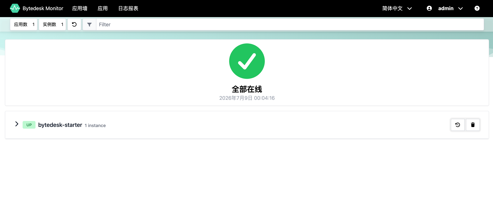
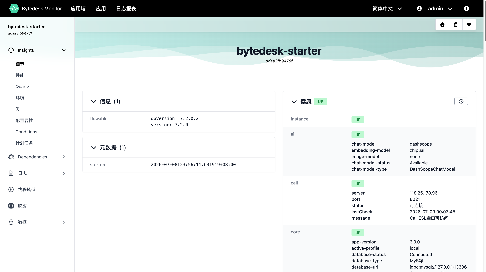
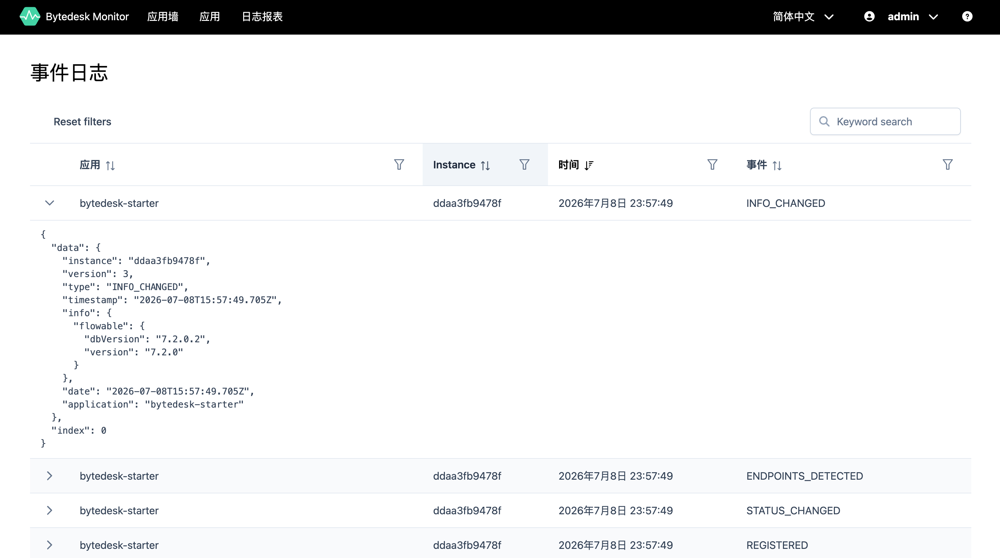
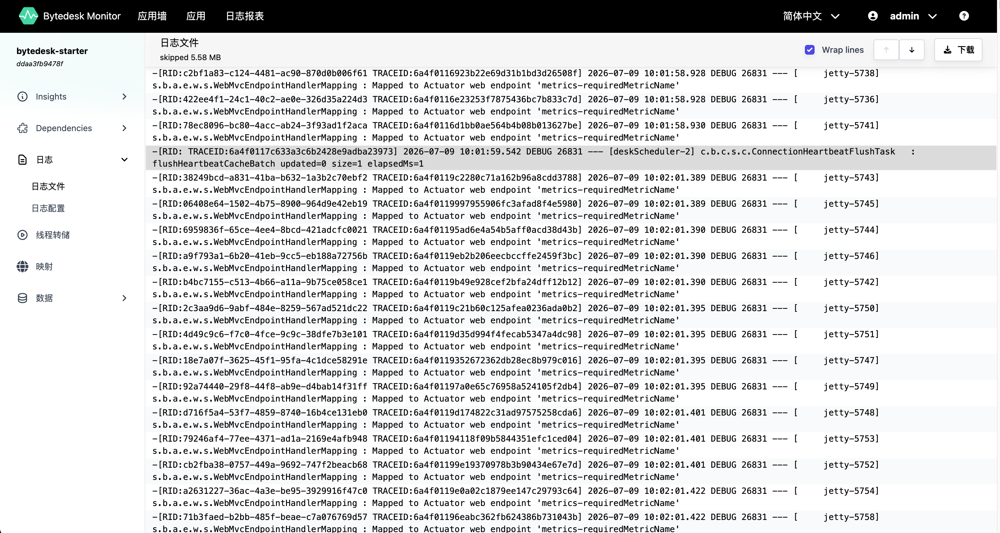
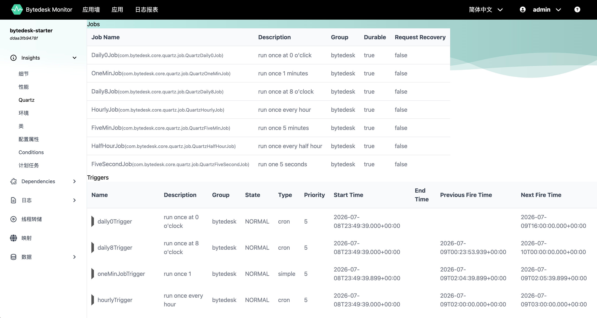
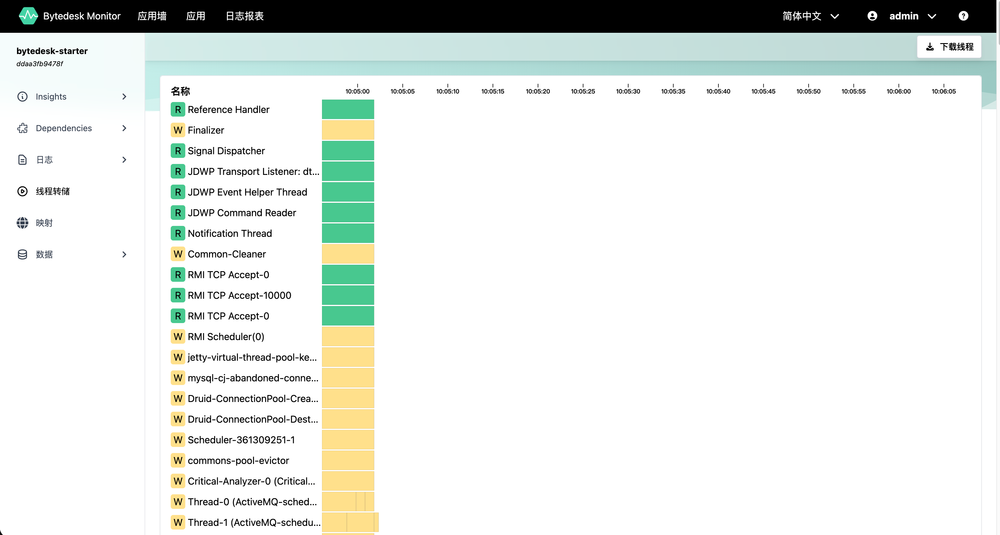

# bytedesk-monitor

基于 **Spring Boot Admin Server** 的 [Bytedesk](https://github.com/Bytedesk/bytedesk) 服务监控面板。

**语言 / Language:** [中文](readme.zh.md) | [English](README.md)

> **代码仓库:** [GitHub](https://github.com/Bytedesk/bytedesk-monitor) | [Gitee](https://gitee.com/bytedesk/bytedesk-monitor)

## 概述

bytedesk-monitor 是一个独立的监控服务，提供统一的健康检查、指标采集、日志查看和环境信息浏览功能，可集中管理所有已注册的 Bytedesk Spring Boot 应用。

## 技术栈

| 组件                | 版本    |
| ------------------- | ------- |
| Spring Boot         | 3.5.16  |
| Spring Boot Admin   | 3.5.9   |
| Java                | 21      |

## 架构

```bash
┌─────────────────┐         注册 / 心跳                    ┌─────────────────────┐
│  bytedesk-starter │ ──────────────────────────────────▶  │  bytedesk-monitor    │
│  (端口 9003)      │  暴露 actuator 端点                   │  (端口 9103)         │
│  SBA Client       │                                      │  SBA Server          │
└─────────────────┘                                      └─────────────────────┘
                                                                │
                                                         管理界面访问
                                                     http://127.0.0.1:9103
```

- **Monitor Server**（`bytedesk-monitor`）：Spring Boot Admin Server，默认端口 `9103`
- **Client**（`bytedesk-starter`）：通过 `spring-boot-admin-starter-client` 自动注册到监控服务端

## 快速开始

### 环境要求

- JDK 21
- Maven 3.x（或使用项目自带的 `mvnw`）

### 1. 启动监控服务

```bash
cd bytedesk-monitor
./mvnw install -Dmaven.test.skip=true
./mvnw spring-boot:run
```

### 2. 启动 Bytedesk 应用

bytedesk starter 已内置 `spring-boot-admin-starter-client` 并配置好自动注册。

```bash
cd bytedesk-3x
./starter/mvnw -f starter/pom.xml spring-boot:run
```

### 3. 打开监控面板

浏览器访问 [http://127.0.0.1:9103](http://127.0.0.1:9103)，登录凭据：

| 字段   | 默认值    |
| ------ | --------- |
| 用户名 | `admin`   |
| 密码   | `admin`   |

> ⚠️ **生产环境**：请通过环境变量 `SPRING_SECURITY_USER_NAME` / `SPRING_SECURITY_USER_PASSWORD` 覆盖默认凭据。

## 构建打包

将项目打包为可执行 JAR：

```bash
./mvnw clean package -Dmaven.test.skip=true
```

生成的 JAR 文件为 `target/bytedesk-monitor.jar`。运行方式：

```bash
# 前台运行
java -jar target/bytedesk-monitor.jar

# 后台运行（日志输出到 logs/app.log）
nohup java -jar target/bytedesk-monitor.jar > logs/app.log 2>&1 &
```

## Docker 使用说明

### 拉取远程镜像

```bash
# Docker Hub
docker pull bytedesk/monitor:latest

# 阿里云镜像仓库（中国大陆推荐）
docker pull registry.cn-hangzhou.aliyuncs.com/bytedesk/monitor:latest
```

### 使用 Docker 运行

```bash
docker run -d \
    --name bytedesk-monitor \
    -p 9103:9103 \
    -e SPRING_SECURITY_USER_NAME=admin \
    -e SPRING_SECURITY_USER_PASSWORD=admin \
    -e TZ=Asia/Shanghai \
    bytedesk/monitor:latest
```

容器启动后访问 `http://127.0.0.1:9103`。

如需使用阿里云镜像源，可将镜像名替换为：

```bash
registry.cn-hangzhou.aliyuncs.com/bytedesk/monitor:latest
```

### 使用 Docker Compose 运行

在项目根目录创建 `docker-compose.yml`：

```yaml
services:
    bytedesk-monitor:
        image: bytedesk/monitor:latest
        container_name: bytedesk-monitor
        ports:
            - "9103:9103"
        environment:
            SPRING_SECURITY_USER_NAME: admin
            SPRING_SECURITY_USER_PASSWORD: admin
            TZ: Asia/Shanghai
        restart: unless-stopped
```

启动与停止命令：

```bash
docker compose up -d
docker compose logs -f
docker compose down
```

## 配置说明

### 服务端（`application.properties`）

```properties
server.port=9103
spring.boot.admin.ui.title=Bytedesk Monitor
spring.boot.admin.monitor.status-interval=10000ms       # 健康检查间隔
spring.boot.admin.monitor.status-lifetime=60000ms       # 状态缓存有效期
spring.boot.admin.monitor.default-timeout=10000ms       # 请求超时

# 安全认证 — Admin UI 登录凭据
spring.security.user.name=admin
spring.security.user.password=admin
```

### 客户端（bytedesk-starter 中）

```properties
spring.boot.admin.client.url=http://127.0.0.1:9103              # Monitor Server 地址
spring.boot.admin.client.username=admin                          # 注册认证用户名
spring.boot.admin.client.password=admin                          # 注册认证密码
spring.boot.admin.client.instance.name=bytedesk-starter          # 实例名称
spring.boot.admin.client.instance.service-base-url=http://127.0.0.1:9003  # 服务地址
```

### 邮件通知（`application-open.properties`）

对外开放或生产环境建议通过环境变量注入 SMTP 凭据和通知收件人，避免将敏感信息直接写入配置文件。

```properties
spring.mail.host=${SPRING_MAIL_HOST:smtp.qiye.aliyun.com}
spring.mail.port=${SPRING_MAIL_PORT:465}
spring.mail.username=${SPRING_MAIL_USERNAME:support@example.com}
spring.mail.password=${SPRING_MAIL_PASSWORD:}
spring.mail.properties.mail.smtp.auth=true
spring.mail.properties.mail.smtp.ssl.enable=true
spring.mail.properties.mail.smtp.ssl.trust=${SPRING_MAIL_SMTP_SSL_TRUST:smtp.qiye.aliyun.com}

spring.boot.admin.notify.mail.enabled=true
spring.boot.admin.notify.mail.to=${SPRING_BOOT_ADMIN_NOTIFY_MAIL_TO:demo@example.com}
spring.boot.admin.notify.mail.from=${SPRING_BOOT_ADMIN_NOTIFY_MAIL_FROM:Bytedesk Monitor <support@example.com>}
```

## 功能特性

- **健康面板** — 实时查看所有注册服务的上下线状态
- **指标监控** — JVM 内存、线程、GC、HTTP 请求等核心指标
- **日志查看** — 在线浏览和搜索应用日志
- **环境信息** — 查看 Spring 环境变量、系统属性
- **线程转储** — 在线捕获和分析 JVM 线程 Dump
- **通知告警** — 服务状态变更时触发通知（离线/恢复）

## 界面预览

### 应用总览



### 应用详情



### 事件日志





## 定时任务



## 线程转储threaddump



## 相关链接

- [Spring Boot Admin 官方文档](http://docs.spring-boot-admin.com/3.5.9/docs/index/)
- [Bytedesk 主项目](https://github.com/Bytedesk/bytedesk)
